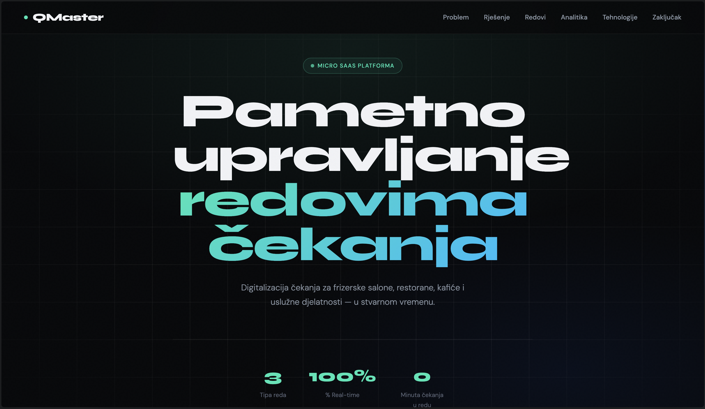

# QMaster

> Pametno upravljanje redovima za male i srednje poslovne subjekte.

QMaster je web aplikacija koja pomaže frizerskim salonima, restoranima, kafiće i uslužnim djelatnostima da organiziraju dolazak klijenata — bez papirnih lista, telefonskih poziva i fizičkog čekanja u redu.



---

## Zašto QMaster?

Svaki dan tisuće malih poslovnih subjekata upravljaju redovima na starinski način — papirima, post-it listićima ili usmenim dogovorom. Klijenti stoje i čekaju, ne znaju koliko će čekati, i često odustaju.

QMaster digitalizira cijeli proces. Vlasnik kreira red za nekoliko sekundi, dijeli link s klijentima, i upravlja svime iz jednog sučelja — s mobitela ili računala.

---

## Kako to izgleda u praksi?

**Za vlasnika poslovanja:**
- Kreira red jednim klikom i otvara ga kad je spreman
- Vidi tko čeka, koliko dugo, i može ih zvati jednim klikom
- Dobiva uvid u statistiku — koliko je klijenata usluženo, prosječno čekanje, najprometniji periodi

**Za klijenta:**
- Skenira QR kod ili otvara link koji mu vlasnik pošalje
- Upisuje ime i telefon — bez registracije, bez aplikacije
- Vidi svoju poziciju u redu i procijenjeno vrijeme čekanja u stvarnom vremenu
- Kada mu dođe red, dobiva obavijest na ekranu

---

## Što sve može?

- **Tri vrste redova** — dnevni (walk-in), trajni (stalno otvoreni) i zakazani (s fiksnim radnim vremenom)
- **Dijeljivi link** — svaki red ima jedinstveni URL koji se može podijeliti, ispisati kao QR kod ili staviti na web stranicu
- **Real-time praćenje** — pozicije u redu se ažuriraju trenutno, bez osvježavanja stranice
- **Automatsko zatvaranje** — red se zatvara sam kad završi radno vrijeme
- **Automatski reset** — dnevni redovi se automatski čiste u ponoć, spremni za sljedeći dan
- **No-show praćenje** — označavanje klijenata koji nisu došli kada su pozvani
- **Dashboard analitika** — pregled svega što se događa kroz dan

---

## Tech stack

Izgrađen na modernom web stacku:

- **Next.js 16** — React framework s App Routerom i Server Componentama
- **Supabase** — baza podataka, autentikacija i real-time subscriptions
- **Tailwind CSS + shadcn/ui** — moderan, responzivan dizajn
- **TypeScript** — type-safe kroz cijeli projekt
- **Vercel** — deployment

---

## Pokretanje lokalno

Trebaš [Node.js 18+](https://nodejs.org), pnpm i [Supabase](https://supabase.com) projekt.

```bash
# Kloniraj repo
git clone https://github.com/your-username/qmaster.git
cd qmaster
pnpm install

# Kopiraj environment varijable
cp .env.example .env.local
# Popuni NEXT_PUBLIC_SUPABASE_URL i NEXT_PUBLIC_SUPABASE_PUBLISHABLE_KEY

# Pokreni SQL migracije u Supabase SQL Editoru (redom iz /supabase/migrations/)

# Pokreni dev server
pnpm dev
```

Otvori [http://localhost:3000](http://localhost:3000).

---

## Deployment

Projekt je spreman za deployment na [Vercel](https://vercel.com) — importaj repo, dodaj environment varijable i deploy.

Nakon deploya, u Supabase projektu ažuriraj **Authentication → URL Configuration** s produkcijskim URLom kako bi OAuth ispravno radio.

---

## Licenca

MIT